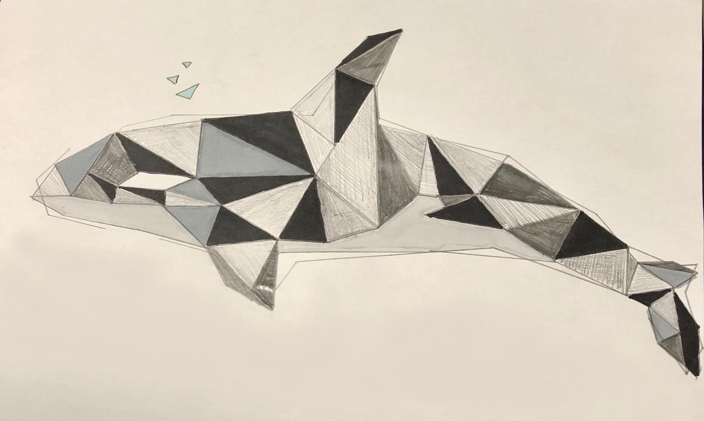

# PolyPaint

ONGOING!

Python 3 - Tkinter - TensorFlow

Created by University of Waterloo students: 

Mark Chen (Comp Sci)

Faiz Momin (Soft Eng)

This is a program that will take any picture and transform it into plain shape art using the 4 Colour Theorem.
We will let the user use 6 colours as 4 can get a little basic...

Our plan is to use DEEP LEARNING so our program knows how to split objects into triangles.

Yeah we are hoping to make that...
